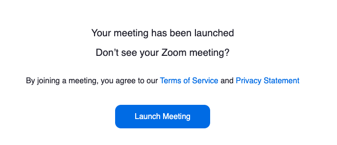

# zoom-tab-closer

Installing this extension automatically closes tabs left open by the zoom meeting application like you see in the image below

### to install 

- Step 1 -> More Tools -> Extensions

- Step 2 -> Enable Developer Mode

- Step 3 -> Drag the repo folder onto the extensions page

### chrome extension service workers

- https://developer.chrome.com/docs/extensions/mv3/service_workers/

A service worker is a script that runs in the background of a web page, separate from the web page itself. 
In the context of a Chrome extension, a service worker can be used to perform tasks such as caching resources, 
handling offline functionality, and intercepting network requests. 

This allows the extension to work offline 
or on low-quality networks. Additionally, service workers can be used to handle push notifications and background syncing.

### chrome extension content scripts

Content scripts are JavaScript files that run in the context of a web page
such as ad blockers, page translators, or password managers, rather than the extension's
background script. They allow an extension to interact with the web page's DOM (Document Object Model) 
and modify its content. Content scripts can access and modify the web page's DOM, but they do not 
have direct access to the web page's JavaScript objects or the extension's background script. 
They can also communicate with the background script via message passing.

Content scripts are useful for extensions that need to modify or extract information from web pages, 
such as ad blockers, page translators, or password managers. They can be used to insert new elements 
into a web page, change the styles of existing elements, or extract data from the page.

- https://developer.chrome.com/docs/extensions/mv3/content_scripts/

